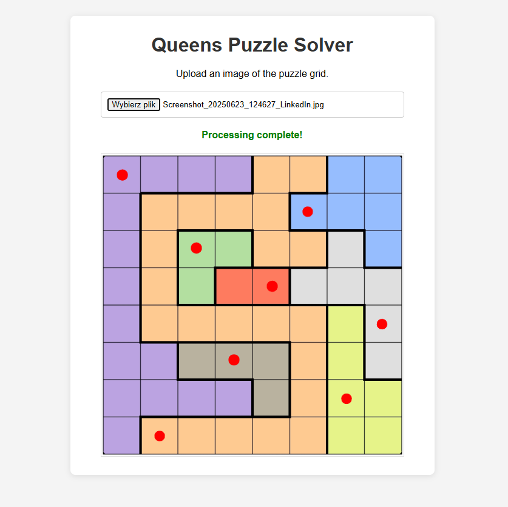

# LinkedIn Queens Solver

A small Flask web app that solves the Queens puzzle from a LinkedIn screenshot. Upload a screenshot of the game board and the app detects the colored grid, finds a valid solution, and returns the image with the queens marked in red.

### Screenshot



## Contents

## English

### Overview

This project is a helper for the daily **Queens** game on LinkedIn. It processes a screenshot of the puzzle directly in the browser. No manual transcription of the board is required.

The solver follows the puzzle rules:

- place exactly one queen in every row;
- place exactly one queen in every column;
- place exactly one queen in every colored region;
- queens cannot touch, including diagonally.

The application:

1. Accepts a screenshot uploaded from the browser.
2. Estimates the background color and detects the puzzle board.
3. Finds the grid corners with OpenCV.
4. Groups cells by their sampled colors.
5. Solves the puzzle with a recursive backtracking algorithm.
6. Returns a PNG with the solution marked by red dots.

### Requirements

Python 3.14 is also supported and is used by the current project environment.

### Installation

Create a virtual environment in the project directory:

```powershell
py -m venv venv
```

Activate it in PowerShell:

```powershell
.\venv\Scripts\Activate.ps1
```

If PowerShell blocks activation for the current session, run:

```powershell
Set-ExecutionPolicy -Scope Process -ExecutionPolicy RemoteSigned
```

Install the dependencies:

```powershell
python -m pip install -r requirements.txt
```

On macOS or Linux, use the equivalent commands:

```bash
python3 -m venv venv
source venv/bin/activate
python -m pip install -r requirements.txt
```

### Running the application

From the project directory, run:

```powershell
python app.py
```

On Windows, you can also run the interpreter directly without activating the environment:

```powershell
.\venv\Scripts\python.exe app.py
```

Open the application at [http://localhost:5000](http://localhost:5000), choose a LinkedIn screenshot, and wait for the processed result.

The development server listens on all interfaces at port `5000`.

### Preparing a LinkedIn screenshot

For reliable detection, use a screenshot that:

- shows the complete puzzle board;
- keeps the colored cells and grid lines visible;
- is cropped to remove unrelated browser content;
- is not blurred, heavily compressed, or scaled;
- has no overlays covering the board;
- includes the board edges and corners.

The solver currently expects a square grid. A screenshot that is heavily cropped, distorted, or covered by other UI elements may not be detected correctly.

Supported image formats: PNG, JPEG, BMP, and WebP.

### Project structure

```text
.
├── app.py                 # Flask application and upload endpoint
├── image_processor.py     # Image detection, puzzle conversion, and solver
├── requirements.txt       # Python dependencies
├── templates/
│   └── index.html         # Browser interface
└── README.md
```

### API endpoint

`POST /upload`

Send a multipart form request with a file field named `image`.

Successful response:

```json
{
  "success": true,
  "image": "data:image/png;base64,..."
}
```

Errors are returned as JSON with `success: false` and an explanatory `error` message.

### Troubleshooting

- **No board or corners are detected:** upload a complete, sharper screenshot with visible grid edges.
- **The grid is detected incorrectly:** crop the screenshot more tightly around the game board and avoid browser scaling.
- **No solution is found:** check that the screenshot shows an actual, unobstructed Queens puzzle.
- **The browser cannot connect:** make sure the Flask process is still running and that port `5000` is available.
- **The virtual environment uses a missing Python version:** remove `venv`, recreate it with an installed Python version, and reinstall `requirements.txt`.

### License

No license has been specified for this project yet.

## Polski

### Co robi aplikacja

To mała aplikacja webowa we Flasku, która rozwiązuje codzienną grę **Queens** z LinkedIna. Wystarczy przesłać zrzut ekranu planszy. Aplikacja wykryje kolorową siatkę, znajdzie poprawne rozwiązanie i zwróci obraz z czerwonymi kropkami oznaczającymi położenie królowych.

Nie trzeba ręcznie przepisywać planszy.

### Zrzut ekranu

<!-- Umieść zrzut aplikacji w screenshots/app.png i odkomentuj poniższą linię. -->

<!--  -->

Aplikacja obsługuje łamigłówki, w których należy umieścić jedną królową w każdym wierszu, każdej kolumnie i każdym obszarze kolorystycznym. Królowe nie mogą znajdować się obok siebie, także po skosie.

Program:

1. Przyjmuje zrzut ekranu przesłany z przeglądarki.
2. Szacuje kolor tła i wykrywa planszę.
3. Znajduje narożniki siatki za pomocą OpenCV.
4. Grupuje pola na podstawie ich kolorów.
5. Rozwiązuje łamigłówkę rekurencyjnym algorytmem backtracking.
6. Zwraca plik PNG z rozwiązaniem zaznaczonym czerwonymi kropkami.

### Wymagania

Python 3.14 również działa i jest używany przez aktualne środowisko projektu.

### Instalacja

Utwórz środowisko wirtualne w katalogu projektu:

```powershell
py -m venv venv
```

Aktywuj je w PowerShellu:

```powershell
.\venv\Scripts\Activate.ps1
```

Jeśli PowerShell zablokuje aktywację w bieżącej sesji, wykonaj:

```powershell
Set-ExecutionPolicy -Scope Process -ExecutionPolicy RemoteSigned
```

Zainstaluj zależności:

```powershell
python -m pip install -r requirements.txt
```

Na macOS lub Linuksie użyj odpowiedników:

```bash
python3 -m venv venv
source venv/bin/activate
python -m pip install -r requirements.txt
```

### Uruchomienie

W katalogu projektu wykonaj:

```powershell
python app.py
```

W systemie Windows można też uruchomić interpreter bez aktywowania środowiska:

```powershell
.\venv\Scripts\python.exe app.py
```

Otwórz aplikację pod adresem [http://localhost:5000](http://localhost:5000), wybierz zrzut ekranu z LinkedIna i poczekaj na wynik.

Serwer deweloperski nasłuchuje na wszystkich interfejsach na porcie `5000`.

### Jak przygotować zrzut ekranu z LinkedIna

Aby zwiększyć szansę poprawnego wykrycia planszy, zrzut ekranu powinien:

- pokazywać całą planszę gry;
- mieć widoczne kolorowe pola i linie siatki;
- być przycięty tak, aby usuwać zbędną część interfejsu przeglądarki;
- nie być rozmazany, mocno skompresowany ani przeskalowany;
- nie zawierać elementów zasłaniających planszę;
- zawierać krawędzie i narożniki planszy.

Solver zakłada kwadratową siatkę. Mocno przycięty, zniekształcony albo zasłonięty zrzut ekranu może zostać wykryty niepoprawnie.

Obsługiwane formaty: PNG, JPEG, BMP i WebP.

### Struktura projektu

```text
.
├── app.py                 # Aplikacja Flask i endpoint przesyłania obrazu
├── image_processor.py     # Wykrywanie obrazu, konwersja planszy i solver
├── requirements.txt       # Zależności Pythona
├── templates/
│   └── index.html         # Interfejs przeglądarkowy
└── README.md
```

### Endpoint API

`POST /upload`

Wyślij żądanie multipart/form-data z plikiem w polu o nazwie `image`.

Przykładowa poprawna odpowiedź:

```json
{
  "success": true,
  "image": "data:image/png;base64,..."
}
```

W przypadku błędu API zwraca JSON z wartością `success: false` oraz opisem w polu `error`.

### Rozwiązywanie problemów

- **Nie wykryto planszy:** prześlij kompletny i wyraźniejszy zrzut z widocznymi krawędziami siatki.
- **Siatka jest wykrywana niepoprawnie:** przytnij obraz dokładniej do planszy i unikaj skalowania obrazu przez przeglądarkę.
- **Nie znaleziono rozwiązania:** sprawdź, czy zrzut pokazuje prawdziwą i niezasłoniętą planszę Queens.
- **Przeglądarka nie może się połączyć:** upewnij się, że proces Flask nadal działa i że port `5000` jest dostępny.
- **Środowisko wirtualne używa nieistniejącej wersji Pythona:** usuń `venv`, utwórz je ponownie przy użyciu zainstalowanej wersji Pythona i zainstaluj `requirements.txt`.

### Licencja

Dla tego projektu nie określono jeszcze licencji.
